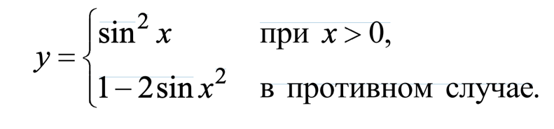
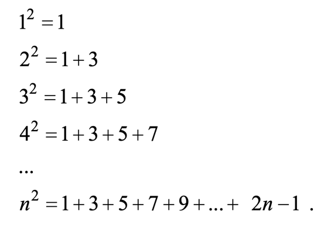
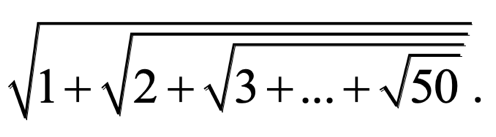
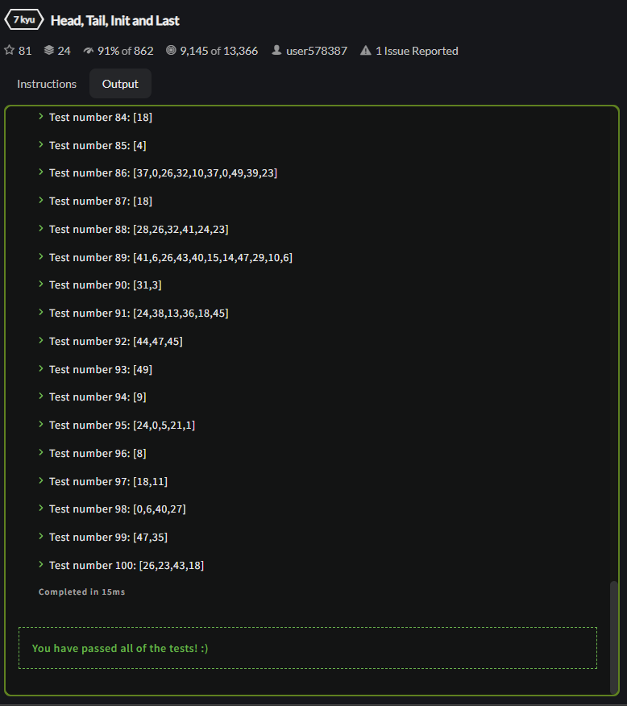

<p align = "center">МИНИСТЕРСТВО НАУКИ И ВЫСШЕГО ОБРАЗОВАНИЯ
РОССИЙСКОЙ ФЕДЕРАЦИИ
ФЕДЕРАЛЬНОЕ ГОСУДАРСТВЕННОЕ БЮДЖЕТНОЕ
ОБРАЗОВАТЕЛЬНОЕ УЧРЕЖДЕНИЕ ВЫСШЕГО ОБРАЗОВАНИЯ
«САХАЛИНСКИЙ ГОСУДАРСТВЕННЫЙ УНИВЕРСИТЕТ»</p>
<br><br><br><br><br><br>
<p align = "center">Институт естественных наук и техносферной безопасности<br>Кафедра информатики<br>Хроменков Владимир Александрович</p>
<br><br><br>
<p align = "center">Лабораторная работа №4<br>«Основы языка <strong>JavaScript</strong>»<br>01.03.02 Прикладная математика и информатика</p>
<br><br><br><br><br><br><br><br><br><br><br><br>
<p align = "right">Научный руководитель<br>
Соболев Евгений Игоревич</p>
<br><br><br>
<p align = "center">г. Южно-Сахалинск<br>2022 г.</p>

***
# <p align = "center">Оглавление</p>
- [Цели и задачи](#цели-и-задачи)
- [Решение задач](#решение-задач)
    - [HTML](#html)
    - [JavaScript](#javascript)
    - [Codewars](#codewars)
- [Вывод](#вывод)

***

# <p align = "center">Цели и задачи</p>

1.  Рассчитать значение `у` при заданном значении `х`

    <p align = "center">
    
    </p>
 
2.	Дано натуральное число `n` (`n <= 9999`). Выяснить, является ли оно палиндромом
("перевертышем") с учетом четырех цифр, как, например, числа `7777`, `8338`, `0330` и т. п. (Палиндромом называется число, десятичная запись которого читается одинаково слева направо и справа налево.)

3.	Год является високосным, если его номер кратен 4, однако из кратных 100 високосными являются лишь кратные 400, например, 1700, 1800 и 1900 — невисокосные года, 2000 — високосный.  
Дано натуральное число `n`. Определить, является ли високосным год с таким номером.

4.	Составить программу для вычисления значения функции `y(x)`:

    <p align = "center">
    
    </p>
 
5.	Составить программу, которая в зависимости от порядкового номера дня месяца (1, 2, ..., 12) выводит на экран время года, к которому относится этот месяц.

6.	Мастям игральных карт условно присвоены следующие порядковые номера: масти "пики" — 1, масти "трефы" — 2, масти "бубны" — 3, масти "червы" — 4, а достоинству карт: "валету" — 11, "даме" — 12, "королю" — 13, "тузу" — 14 (порядковые номера карт остальных достоинств соответствуют их названиям: "шестерка", "девятка" и т. п.). По заданным номеру масти `m` (1 m 4) и номеру достоинства карты `k` (6 k 14) определить полное название (масть и достоинство) соответствующей карты в виде `"Дама пик"`, `"Шестерка бубен"` и т. п.

7.	В некоторых странах Дальнего Востока (Китае, Японии и др.) использовался (и неофициально используется в настоящее время) календарь, отличающийся от применяемого нами. Этот календарь представляет собой 60-летнюю циклическую систему. Каждый 60-летний цикл состоит из пяти 12-летних подциклов. В каждом подцикле года носят названия животных: Крыса, Корова, Тигр, Заяц, Дракон, Змея, Лошадь, Овца, Обезьяна, Петух, Собака и Свинья. Кроме того, в названии года фигурируют цвета животных, которые связаны с пятью элементами природы — Деревом (зеленый), Огнем (красный), Землей (желтый), Металлом (белый) и Водой (черный). В результате каждое животное (и его год) имеет символический цвет, причем цвет этот часто совершенно не совпадает с его "естественной" окраской — Тигр может быть черным, Свинья — красной, а Лошадь — зеленой. Например, 1984 год — год начала очередного цикла — назывался годом Зеленой Крысы. Каждый цвет в цикле (начиная с зеленого) "действует" два года, поэтому через каждые 60 лет имя года (животное и его цвет) повторяется. Составить программу, которая по заданному номеру года нашей эры n печатает его название по описанному календарю в виде: "Крыса, Зеленый".  
Рассмотреть два случая: а) значение `n = 1984`; б) значение `n` может быть любым натуральным числом.

8.	Напечатать таблицу умножения на `9`.

9.	Напечатать "столбиком" значения `sin 2` , `sin 3` , ..., `sin 20` .

10.	Найти: а) сумму всех целых чисел от `100` до `500`; б) сумму всех целых чисел от `a` до `500` (значение `a` вводится с клавиатуры; `a <= 500`); в) сумму всех целых чисел от `–10` до `b` (значение `b` вводится с клавиатуры; `b => –10`); г) сумму всех целых чисел от `a` до `b` (значения `a` и `b` вводятся с клавиатуры; `b => a`).

11.	Вычислить сумму

    <p align = "center">
    
    </p> 

12.	Даны натуральные числа `х` и `у`. Вычислить `произведение` `x` и `y`, используя лишь операцию `сложения`. Задачу решить двумя способами.

13.	Составить программу возведения натурального числа в квадрат, учитывая следующую закономерность

    <p align = "center">
    
    </p>

14.	Вычислить сумму
 
    <p align = "center">
    
    </p>

15.	Дана непустая последовательность целых чисел, оканчивающаяся нулем. Найти: а) сумму всех чисел последовательности; б) количество всех чисел последовательности.

16.	Дана непустая последовательность неотрицательных целых чисел, оканчивающаяся отрицательным числом. Найти среднее арифметическое всех чисел последовательности (без учета отрицательного числа).

17.	Дано натуральное число. Определить: а) количество цифр `3` в нем; б) сколько раз в нем встречается последняя цифра; в) количество четных цифр в нем. Составное условие и более одного неполного условного оператора не использовать; г) сумму его цифр, больших пяти; д) произведение его цифр, больших семи; е) сколько раз в нем встречаются цифры `0` и `5` (всего).

18.	Дано натуральное число, в котором все цифры различны. Определить: а) порядковый номер его максимальной цифры, считая номера: от конца числа; от начала числа; б) порядковый номер его минимальной цифры, считая номера: от конца числа; от начала числа.
19.	Дано натуральное число. Выяснить, является ли оно простым (простым называется натуральное число, большее `1`, не имеющее других делителей, кроме единицы и самого себя). Оператор цикла с параметром не использовать.

20.	Дано натуральное число. Установить, является ли последовательность его цифр при просмотре их слева направо упорядоченной по возрастанию. Например, для числа `1478` ответ положительный, для чисел `1782` и `1668` — отрицательный и т. п.

21.	Дана непустая и упорядоченная по возрастанию последовательность целых чисел, оканчивающаяся числом `10 000`. Определить порядковый номер первого числа, большего заданного `n`. Если таких чисел в последовательности нет, то на экран должно быть выведено соответствующее сообщение.

22.	Дано натуральное число. Верно ли, что цифра `a` встречается в нем реже, чем цифра `b`?

23.	Имеется фрагмент программы в виде оператора цикла с параметром, обеспечивающий вывод на экран "столбиком" всех целых чисел от `10` до `30`. Оформить этот фрагмент в виде: а) оператора цикла с предусловием; б) оператора цикла с постусловием.

## [Codewars](https://www.codewars.com)

24.	[Head, Tail, Init and Last](https://www.codewars.com/kata/head-tail-init-and-last)

25.	[Array Deep Count](https://www.codewars.com/kata/array-deep-count)

26.	[Length of missing array](https://www.codewars.com/kata/length-of-missing-array)

27.	[Pair of gloves](https://www.codewars.com/kata/pair-of-gloves)

28.	[Sorting by bits](https://www.codewars.com/kata/sorting-by-bits)

29.	[Let's Recycle!](https://www.codewars.com/kata/lets-recycle)

***

# <p align = "center">Решение задач</p>

## HTML

```html

```

## JavaScript

```js
//
```

## [Codewars](https://www.codewars.com) ([Profile Link](https://www.codewars.com/users/ZFGinc))

### Head, Tail, Init and Last

```js
function head(arr) { return arr[0]; }
function tail(arr) { return arr.slice(1); }
function init(arr) { return arr.slice(0, arr.length-1); }
function last(arr) { return arr[arr.length-1]; }
```

<p align = "center">

</p>

### [Array Deep Count](https://www.codewars.com/kata/array-deep-count)

```js
//
```

<p align = "center">

</p>

### [Length of missing array](https://www.codewars.com/kata/length-of-missing-array)

```js
//
```

<p align = "center">

</p>

### [Pair of gloves](https://www.codewars.com/kata/pair-of-gloves)

```js
//
```

<p align = "center">

</p>

### [Sorting by bits](https://www.codewars.com/kata/sorting-by-bits)

```js
//
```

<p align = "center">

</p>

### [Let's Recycle!](https://www.codewars.com/kata/lets-recycle)

```js
//
```

<p align = "center">

</p>

***

# <p align = "center">Вывод</p>

Выполнил *лабораторную работу №4*, совершенствую навыки работы с языком `JavaScript`. Также продолжаю осваивать систему `git`.
